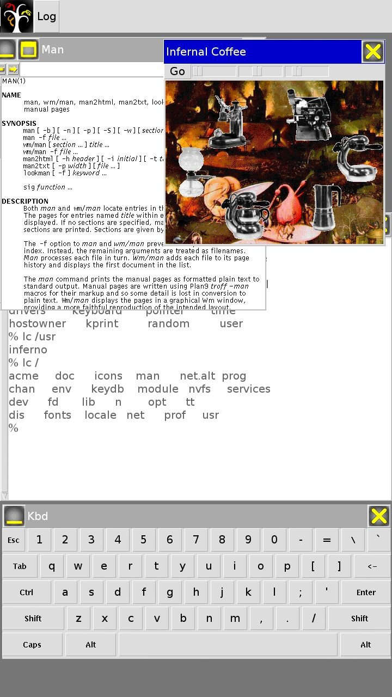
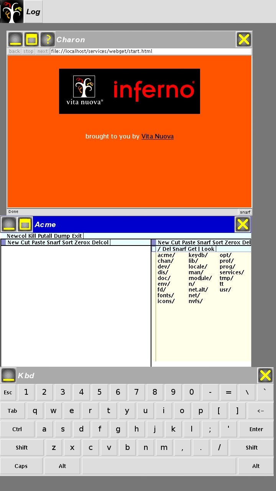

# Inferno-OS_Android



for Android > v4.0 (api 14)

it is based on the last [official sources from Vitanuova](https://bitbucket.org/inferno-os/inferno-os/).

## What is working now
* Gui. for compatibility main gui app is `wm/awm` (it loads wm/awm after start). sources are in the `/appl/awm` and `/appl/alib`,
* Touch screen. Only single touches. Don't know where to use multitouches in the Inferno,
* Files. File-tree are stored in the `/sdcard/Inferno` folder (permission), 
* Network. Both styx and the regular tcp connections (permission),

## What was changed
* Gui. Bigger icons, bigger keys on the keyboard, bigger captions on windows, some icons were changed (because of sizes),
* Display output. Because of Android. This way is a little experimental still and may be changed in the future.

## What was added
* Was added support of `.PNG` and `.SVG` images. They may used now in the places where may be used .BIT images. For example as a parameter `-bitmap` of Tk controls calls.
* `.TTF` fonts (and maybe `.T1` and other) is supported internally using embedded libfreetype. to use, specify them as subfonts in the font files,
* command line (in the format of the regular emu commang line). has restrictions (mostly in the graphic parameters and the jit). because of restrictions of the hardware. [JIT compiler was buit for other kind of FPU](https://bitbucket.org/inferno-os/inferno-os/issues/344/charon-doesnt-start-on-the-open-pandora#comment-31995777)

## Build media note
It is built under Windows. But if you are using Linux it is easy to build it under Linux. only a pair of changes. go to the "inferno-os" folder and rewrite "bld.bat" script to Linux style. also do not forget to configure to Linux tools by modifying "makeconfig" script and so on.

## Dependencies
* Android Studio > v3.0
* Cmake plugin for Android Studio
* NDK 

# how to build

## Windows host
```
cd inferno-os
bld.bat
```
after the successful building of the inferno libs (`./inferno-os/Android/arm/lib`)
open this project in the Android Studio and build apk.

# how to run
install this apk on the android
copy this inferno tree (`./inferno-os`) to android by the path `/sdcard/Inferno`.

run it


